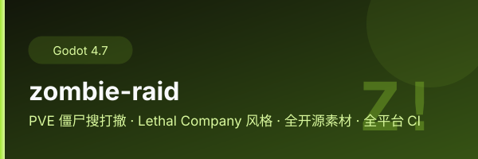

<div align="center">
  
</div>

# Zombie Raid 🧟 — PVE 搜打撤（Lethal Company 式）

> 夜幕城市搜刮物资 → 潜入地下设施抢金箱 → 冲回绿色光柱撤离 → 配额翻倍，越滚越深。
> Godot 4.7 + 全开源素材拼凑：KayKit 城市/骷髅/冒险者/地牢包（CC0）+ Kenney 科幻武器与音效（CC0）。


## 🎮 网页直接试玩

**https://lilyco-42.github.io/zombie-raid/** （WebAssembly 多线程，首次加载 ~75MB 需等待）

## 玩法

- **搜 Search**：夜里进死城，摸医疗包、捡枪、收物资（发光箱子）
- **打 Fight**：三种丧尸（迅捷尸/普通尸/蛮兵），难度 6 分钟内持续爬升
- **撤 Extract**：城市路口的拱门下到**地下设施**（高价值废料），找到绿色光柱站 3 秒撤离
- **配额 Quota**：STASH 达到 QUOTA 即翻倍，滚雪球压力；**死了本局物资全丢**
- **设施驻守 Spitter**：地下设施里有 Mage 法师远程吐酸弹（撞墙即碎，贴脸改爪击）
- **月出倒计时**：8 分钟后天亮失败——丧尸全体狂暴，再 90 秒月走人亡
- **负重**：捡的物资越多跑得越慢（最多 -35%），要不要贪下一箱？

## 操作

| 键 | 动作 |
|---|---|
| WASD / 鼠标 | 移动 / 视角 |
| 左键 / R | 射击 / 换弹 |
| Shift / C | 疾跑（体力）/ 下蹲 |
| Q / E | 左右侧倾 |
| F / G | 近战 / 丢枪 |
| **V** | 第一/第三人称切换（兜帽游侠身体 + 越肩弹簧臂相机） |
| **T** | 手电筒 |
| **鼠标中键** | 扫描器：高亮全图战利品（价值+距离）与撤离点 |

## 🌐 联机（Minecraft 式 C/S，最多 4 人）

左下角 **CO-OP 面板**：**F5 开房 / F6 加入**（输入主机 IP，UDP 24565，UPnP 自动尝试）。
世界种子一次同步，各端确定性重建同一座城市；之后主机就是权威服务端
（丧尸 AI / 刷怪 / 掉落 / 计时全部主机跑，客户端只是渲染器 + 输入器）：

- 丧尸快照 15Hz 序号流，客户端 **3 快照延迟插值**（MC lerpSteps 同款）；
- 命中上报经主机**校验**（限频 / 伤害 / 距离钳制）才生效；
- 战利品箱**先到先得**（按坐标认领）；**任一玩家死亡 = 全团 raid 失败**；
- 任意一人站进撤离光柱 3 秒 = **全队结算**，各自入袋自己的 run_loot；
- 支持中途开房（世界不必重开）与迟到加入（跳过商店直接进场）。

架构细节见 [`docs/NET_ARCHITECTURE.md`](docs/NET_ARCHITECTURE.md)。

## 构建（GitHub Actions 全平台矩阵）

一次 push → `.github/workflows/build-all.yml` → 各平台并行导出 → 全绿自动打 Release：

| 目标 | 产物 |
|---|---|
| Windows x64 / arm64 | `.exe` |
| Linux x86_64 / arm64 | ELF（内嵌资源） |
| macOS universal (x64+arm64) | `.zip`（.app，未签名） |
| Android arm64 | `.apk`（CI 临时 keystore 签名） |
| iOS arm64 | `.ipa`（未签名，可自签侧载） |
| Web / WASM | `index.html + .wasm`（鸿蒙浏览器可直接跑） |
| HarmonyOS | `.hap`（[godot-ohos](https://github.com/godothub/godot-ohos) 插件） |

本地导出：装 Godot 4.7.2 + 导出模板后 `godot --headless --path . --export-release "<Preset>" <out>`。

## 项目结构

```
zombie-raid/
├── game/            # 玩法层（我们写的）：scripts + scenes
│   ├── scripts/     # 僵尸AI/管理器/触控/相机/建筑生成/Sfx/Stash...
│   └── scenes/      # world_raid.tscn（主场景）、zombie.tscn
├── vendor/          # 开源底座：chafmere FPS 模板（MIT，玩家控制器+武器系统）
├── assets/          # 开源素材：kaykit（城市/骷髅/冒险者/地牢，CC0）+ sfx
├── tests/           # headless 回归测试（触控/吐弹/TP导航）
├── ci/              # CI 附属（coi-serviceworker）
└── .github/workflows/build-all.yml   # 九平台构建+发布
```

## 协议

`LICENSE.md` — **作者保留全部知识产权，任何人可随意商用**（不必署名、不必开源、不必付费）。
第三方素材许可见 `THIRD_PARTY_NOTICES.md`（模板 MIT，素材 CC0）。
